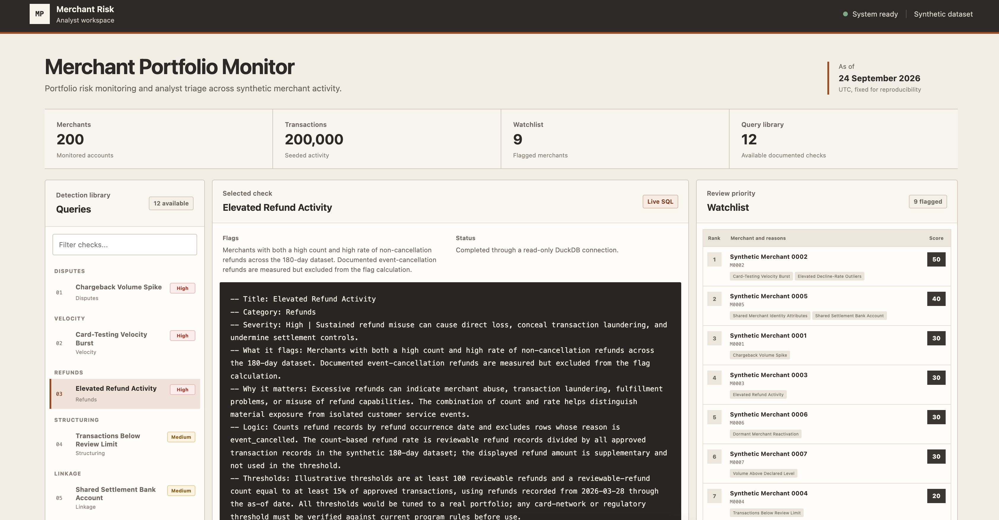

# Merchant Portfolio Monitor

Merchant Portfolio Monitor is a local demonstration application for portfolio risk monitoring and analyst triage. It uses documented SQL checks to surface merchant-level risk signals, rank flagged merchants with an explainable score, and show the evidence behind each result.

The tool is intended for fraud, payments-risk, trust and safety, and merchant-monitoring analysts who want to review how portfolio signals can be expressed as readable SQL. It is not a production decision system and does not claim real-world detection accuracy.

## Screenshot



## Install and run

Python 3.11 or later is recommended.

```bash
python3 -m venv .venv
source .venv/bin/activate
pip install -r requirements.txt
python scripts/generate_data.py
uvicorn app.main:app --reload
```

Open [http://127.0.0.1:8000](http://127.0.0.1:8000).

The generator writes synthetic CSV files and a manifest under `data/`. When FastAPI starts, it loads those files into `data/merchant_portfolio.duckdb` and prints the table row counts.

Run the tests with:

```bash
pytest -q
```

## Query library

Every query has a standardized analyst header covering its purpose, risk relevance, exact logic, illustrative thresholds, likely false positives, next step, output definitions, and data notes. Query results include a plain-English reason alongside the underlying measures.

### Activity Change

- **High: Dormant Merchant Reactivation.** Identifies substantial activity after a defined period with no transactions.
- **High: Volume Above Declared Level.** Compares recent approved volume with the merchant's declared monthly volume.
- **Medium: Sudden Ticket-Size Increase.** Compares recent average ticket size with historical and declared ticket values.

### Disputes

- **High: Chargeback Volume Spike.** Finds a material increase in newly recorded chargebacks relative to the preceding comparison window.

### Linkage

- **Medium: Shared Settlement Bank Account.** Prioritizes a newer merchant sharing a settlement token with an older merchant.
- **Medium: Shared Merchant Identity Attributes.** Returns merchant linkages based on shared bank, phone, or address tokens.

### Portfolio

- **Low: Portfolio Merchant Summary.** Provides one contextual activity row per merchant and does not independently add watchlist points.
- **Medium: Elevated Decline-Rate Outliers.** Ranks merchants with substantial recent attempt volume and an elevated decline rate.
- **Low: Merchant Volume Concentration.** Shows the merchants contributing the most recent approved portfolio volume. It is an exposure and portfolio-summary query, not a merchant risk signal.

### Refunds

- **High: Elevated Refund Activity.** Measures non-cancellation refund count and rate while separately reporting documented event-cancellation refunds.

### Structuring

- **Medium: Transactions Below Review Limit.** Finds approved amounts concentrated immediately below an illustrative internal review limit.

### Velocity

- **High: Card-Testing Velocity Burst.** Finds dense hourly bursts of low-value attempts across many cards from one source.

Severity supports triage order:

- **High:** Review first because the signal can represent immediate loss or active abuse exposure.
- **Medium:** Review after high-severity cases because the signal represents a material risk change that needs context.
- **Low:** Use for monitoring, portfolio context, or review when capacity permits.

## Watchlist scoring

The watchlist is an explainable weighted sum of the queries that flag each merchant:

- High-severity query: 30 points
- Medium-severity query: 20 points
- Low-severity risk query: 10 points
- Portfolio Merchant Summary: 0 points because it is informational and returns every merchant
- Merchant Volume Concentration: 0 points because it reports portfolio exposure rather than merchant risk

A query contributes its weight at most once per merchant. The watchlist ranks merchants by total score and uses merchant ID as the deterministic tie-breaker. Reason chips show the titles of contributing queries, and expanding a merchant displays each query's weight and plain-English result reason. Weights are defined in `app/scoring_weights.json`.

## Custom SQL safety

The custom SQL box is intended for limited, read-only exploration:

- DuckDB's parser must identify exactly one statement.
- Only a parsed `SELECT` or `WITH` statement is accepted.
- Queries run through a read-only DuckDB connection.
- External file and extension access is disabled.
- Results are capped at 500 rows.
- Execution is isolated in a disposable worker process with a 2.5-second timeout.
- Rejected and failed queries return sanitized errors without internal file paths.

These controls are defense in depth. They do not turn the feature into a general-purpose SQL environment.

## Data

All data is synthetic. No real merchant, customer, card, bank-account, address, or case data is included.

`scripts/generate_data.py` uses the fixed seed `20260924` and the fixed as-of date `2026-09-24T00:00:00Z`. It reproducibly creates 200 merchants, 200,000 transactions, refunds, chargebacks, eight planted risk patterns, and three legitimate decoy merchants. Running the generator twice produces byte-identical output.

## Limitations

- Thresholds are illustrative and have not been tuned or validated against a real merchant portfolio.
- The schema and event lifecycle are simplified for demonstration and do not represent a complete payments data model.
- No real card-network, regulatory, or monitoring-program thresholds are applied. Any such rules must be verified against current authoritative program documentation before use.
- Synthetic planted patterns make test outcomes deterministic but do not establish performance on real data.
- The watchlist weights are illustrative prioritization values, not calibrated loss estimates or automated enforcement criteria.
- The application is a local analytical demonstration, not a production monitoring, case-management, or merchant-action system.
